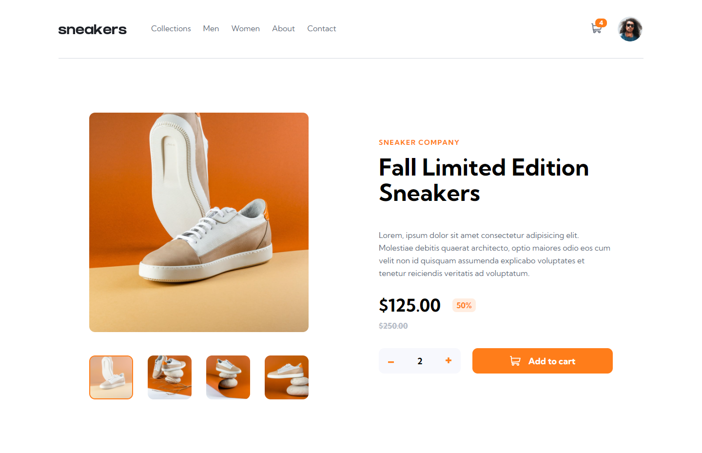
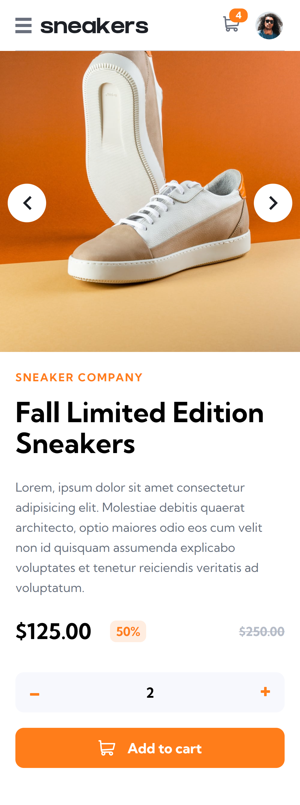

# Frontend Mentor - E-commerce product page solution

This is a solution to the [E-commerce product page challenge on Frontend Mentor](https://www.frontendmentor.io/challenges/ecommerce-product-page-UPsZ9MJp6). Frontend Mentor challenges help you improve your coding skills by building realistic projects.

## Table of contents

- [Overview](#overview)
  - [The challenge](#the-challenge)
  - [Screenshot](#screenshot)
  - [Links](#links)
- [My process](#my-process)
  - [Built with](#built-with)
  - [What I learned](#what-i-learned)
  - [Continued development](#continued-development)
- [Author](#author)

## Overview

### The challenge

Users should be able to:

- View the optimal layout for the site depending on their device's screen size
- See hover states for all interactive elements on the page
- Open a lightbox gallery by clicking on the large product image
- Switch the large product image by clicking on the small thumbnail images
- Add items to the cart
- View the cart and remove items from it

### Screenshot

### Links

- Solution URL: 
- Live Site URL: 

## My process

### Built with

- [React](https://reactjs.org/) - JS library
- Semantic HTML5 markup
- [SCSS](https://sass-lang.com/) - CSS preprocessor
- Flexbox

### What I learned

Major learning opportunities using this project were using redux with redux toolkit and styling components using CSS.

### Continued development

This project will further be used in creation of a complete e-commerce store project. Stay with us and follow me for the development.

## Author

- Website - [Asidipta Chaudhuri](https://portfolio-asi309.vercel.app/)
- Frontend Mentor - [@asi309](https://www.frontendmentor.io/profile/asi309)
